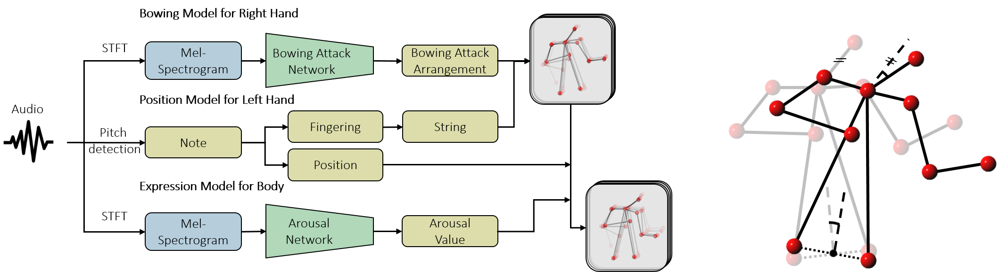

# Violin-Body-Movement-Generation

This project aims to generate expressive violinists’ body movements based on a violin recording solo. Considering the multifaceted characteristics of musical movements on string instruments, we take a divide-and-conquer approach to tackle the problem and proposed a framework for the generation.

For evaluation, both objective and subjective evaluation shows that the proposed framework improves the stability as well as the perceptual quality of the generation outputs by using the task-specific models for bowing and expressive movement compared to the [baseline model](https://arxiv.org/abs/1712.09382).

For those whom would interested in more technical details, the paper can be found [here](https://ieeexplore.ieee.org/abstract/document/9054463).

## Quick Start

After downloading this repository, please open ```skeletonGeneration_Main.py```, modify the parameters in the first section, and then run it. It will output a csv file of final generated skeleton coordination of your given violin solo. Please be noted that the format of the given clip should be 16 bits wav file.

## Overview

In general, the framework takes audio as input, and outputs a 20-D sequence containing the 2D location of 10 body joints. There are three task-specific models in this framework to deal with movements in different body parts, namely **the bowing model for right hand**, **the position model for left hand**, and **the expression model for upper body**.

Here is the illustration of the proposed framework:



In the bowing model, we trained a CNN to predict bowing attack, the time instance when the bowing direction changes. The bowing movement generation problem is then simplified into the process of stretching or truncating the **templates**, of which boundary and duration are based on bowing attack prediction.

In the position model, the left hand movement was generated based on the position information derived from the Pitch Detection Algorithm(PDA).

In the expression model, we aim to consider music expression while generating violinists’ body movements. We focus only on arousal aspect of music expression, and the expression model is thus an arousal-predicting network and a parametric model relating arousal to head and torso tilt.

## Installation

To install the package requirements, enter the following command:

```
pip install -r requirements.txt
```

## Usage

#### Pre-processing

This project consists of two neural networks, Bowing Attack Networks trained with [URMP dataset](http://www2.ece.rochester.edu/projects/air/projects/URMP.html) and Arousal Networks trained with [DEAM datasets](http://cvml.unige.ch/databases/DEAM/). All the data required for training two neural networks have been processed by running ```dataPreProcessing.py```. Both raw data and processed data can be found [here](https://drive.google.com/drive/folders/12JcY1ANmQFa7I_Cu8EMUWbIgJg0_lSz-?usp=sharing). For more details on training data, please refer to *Dataset_README.txt*. 

#### Training

Both networks have already been trained with default features in the paper, as checkpoints file, ```bowingAttackNetwork_model.h5``` and ```arousalNetwork_model.h5```, are available for a quick start.

If you want to train the networks with different features, please first download the processed data (link can be found in the [Pre-processing](#pre-processing) section), modify the parameters (data location and network features) in ```bowingAttackNetwork_training.py``` or ```arousalNetwork_training.py```, and run it.
